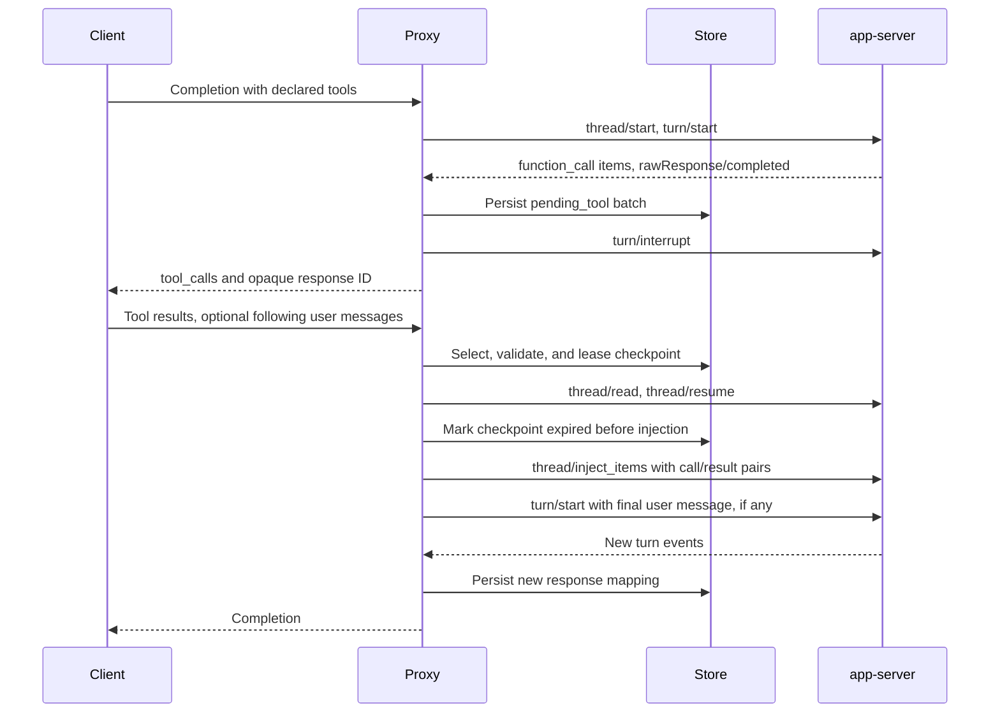

# Continuation and client tools

This page explains how the proxy preserves a Codex thread across Chat Completions requests. It is for contributors changing continuation, dynamic tools, or usage accounting. For the client request format, see [Function tools and Codex-specific extensions](client-api.md#function-tools).

## Durable response mappings

The proxy returns an opaque Chat Completions response ID and stores its Codex thread mapping in `continuations.json` under the configured state directory. The store uses schema version `0`, writes a same-directory temporary file followed by atomic rename, and treats unreadable or unsupported data as untrusted. Records expire after 30 days by default; a newer response on the same thread supersedes its previous ready or pending record. The store retains expired records for a further retention interval before pruning them.

| Stored value                                                                               | Why it matters                                                                                                                                          |
| ------------------------------------------------------------------------------------------ | ------------------------------------------------------------------------------------------------------------------------------------------------------- |
| Response ID, thread ID, state, and timestamps                                              | Select the newest usable checkpoint without exposing a raw Codex thread ID to clients. States are `ready`, `pending_tool`, `expired`, and `superseded`. |
| Model, reasoning effort, canonical working directory, tool hash, and effective-policy hash | Native reuse requires an identical thread binding. The hashes use SHA-256 over recursively key-sorted JSON, with ordering independent of locale.        |
| Pending call ID, name, and exact argument string                                           | Rebuild each complete `function_call`/`function_call_output` pair after a client returns tool results, including after a proxy restart.                 |
| Optional exact cumulative `usageTotal`                                                     | Establish the next response's token-accounting boundary without estimating missing usage. An all-zero boundary is valid.                                |

The [store schema](../protocol/schemas/response-mapping.schema.json) describes the persisted shape. `ResponseStore` owns disk writes and retention; `ContinuationCoordinator` owns transport-generation leases and dynamic-tool callback routing. Both live in [`src/continuation/state.ts`](../src/continuation/state.ts).

## Admission before execution

[`prepareContinuation`](../src/http/chat-execute.ts) makes one synchronous choice before any app-server setup RPC. An explicit `previous_response_id` selects a record; without one, a terminal contiguous tool-result block can identify exactly one unexpired pending record by its call IDs. Implicit lookup can be disabled through the CLI. A compatible record must also have an available local thread lease. The proxy reports native reuse only after `thread/resume` and the next `turn/start` succeed.

| Condition                                                                                                                  | Outcome                                                                                                                                              |
| -------------------------------------------------------------------------------------------------------------------------- | ---------------------------------------------------------------------------------------------------------------------------------------------------- |
| No selector and no terminal tool results                                                                                   | Start a fresh Codex thread.                                                                                                                          |
| Unknown, expired, or superseded record; ambiguous or unavailable implicit lookup                                           | Execute the supplied transcript on a fresh thread after fallback-history validation.                                                                 |
| Changed model, reasoning effort, working directory, tools, or effective policy; local thread contention                    | Execute the supplied transcript on a fresh thread, leaving the source mapping and any lease untouched.                                               |
| Active client tools but no raw-response batch capability on the current transport                                          | Execute on a fresh thread. This includes active-tool continuations after an app-server restart. Tool-free restart continuation can reuse the thread. |
| Matching current record and available lease                                                                                | Read and resume the mapped idle thread, then start one turn.                                                                                         |
| Invalid results against a live pending batch, duplicate result IDs, or results sent to a live ready record                 | Return a typed client error before execution.                                                                                                        |
| Remote read/resume failure, non-resumable app-server status, injection/start failure, cancellation, or persistence failure | Return the error; never dispatch a second execution.                                                                                                 |

Fresh fallback replays only the transcript supplied with that request. Its history must pair every assistant client-tool call with the immediately following result block, and must contain no orphan results; the exceptional case of abandoning a selected pending batch with no submitted results may leave its calls unanswered. The source checkpoint remains unchanged on fallback, so separate requests can execute equivalent work on different threads. Native reuse instead keeps Codex's existing thread history and supplies only new input. This is a preference for continuity, not exactly-once execution across requests.

## Tool batch and result handoff

Fresh threads enable raw app-server response events. Direct declared `function_call` items and the matching `rawResponse/completed` delimit a client-tool batch; callbacks are merged by call ID. A callback dispatched after its raw completion gets a one-second quiet window, reset by another callback. The proxy durably records the batch, interrupts the originating Codex turn, and returns `finish_reason: "tool_calls"`. Cancelled app-server callbacks are left unanswered because the interrupt already resolved them. No Codex turn remains parked while the client runs its functions.

For a live pending batch, validation checks the immediately preceding assistant call batch against the recorded IDs, names, and argument strings, requiring each result exactly once. Implicit continuation accepts only a terminal tool-result block. An explicit selector can accept that block followed by consecutive user messages. Earlier suffix users are injected after the call/result pairs in order; the last becomes the new turn's input. A user message splitting a parallel result block is invalid. Earlier completed tool rounds in a replayed transcript do not participate in current-batch correlation.

Before injecting results, the proxy durably marks the pending record `expired`. This replay guard survives an ambiguous injection failure; successful injection then best-effort marks it `superseded`. A new response mapping is written for the continued turn. Process-local tombstones separately prevent delayed callbacks from an interrupted turn from being routed to a newer turn on the same thread.

## Usage boundary

The event normalizer attributes exact app-server token totals from the current turn, excluding pre-turn usage replayed by `thread/resume`. A response may span several upstream model requests, so it subtracts its stored cumulative baseline from the latest complete `thread/tokenUsage/updated` total. If complete cumulative attribution is unavailable, it can use an attributable exact `last` breakdown; unavailable counts are omitted. Raw response usage is not added to HTTP usage because that could count the same tokens twice.

Completed and interrupted turns collect updates for a fixed one-second window after the first idle notification. Earlier usage and later corrections do not end or extend that window. A ten-second terminal collection backstop, request abort, or transport/queue failure can end it sooner. This adds up to one second after idle before aggregate output or streaming terminal frames; text and tool deltas still stream as they arrive.

After persisting the continuation, streaming emits the final usage once in an empty-choice chunk, then the finish reason and `[DONE]`. Unlike the previous finish-then-usage ordering, this lets clients stopping at `finish_reason` receive counts without duplicate usage records. Clients must locate the usage field instead of assuming usage occupies the last chunk. Explicit `stream_options.include_usage: false` suppresses only its HTTP output, not collection or boundary persistence.

Each successful response records the exact boundary the next response should use. A pending tool response that receives no usage keeps its starting boundary, allowing the continuation to report those tokens when app-server later attributes them. The handoff therefore does not invent usage or discard a known zero boundary. See [`src/http/chat-normalize.ts`](../src/http/chat-normalize.ts) for attribution and [`src/http/chat-execute.ts`](../src/http/chat-execute.ts) for persistence at terminal events.
